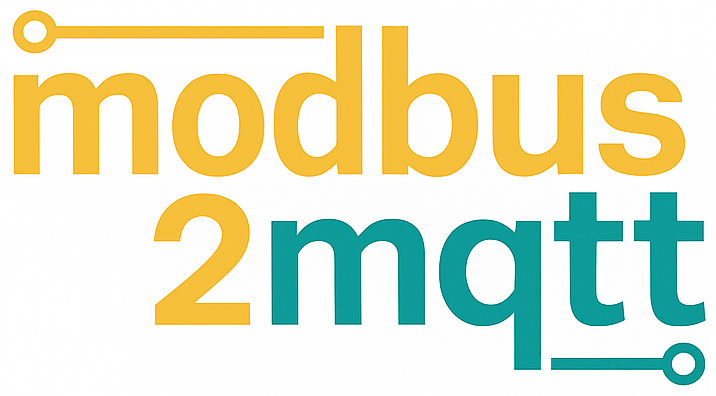
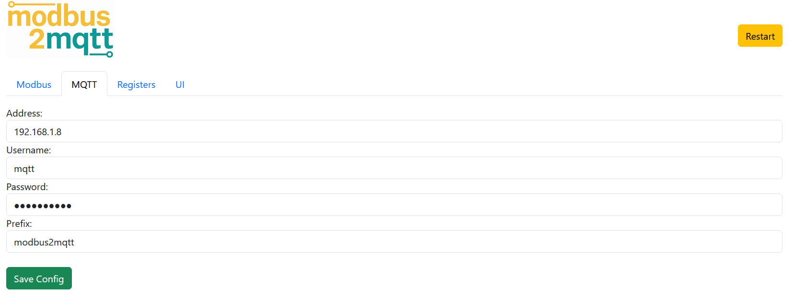
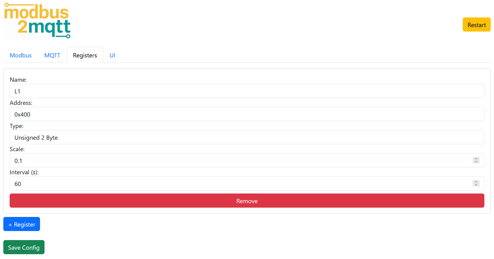
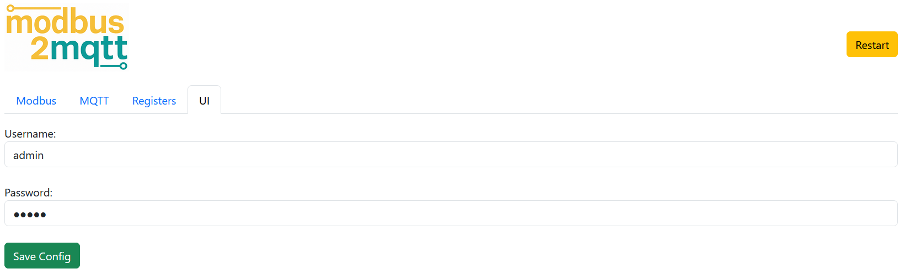

<h2 align="center">
  
  <br>
  <i>Modbus RTU to MQTT Adapter</i>
  <br>
</h2>

This project is a **Modbus RTU to MQTT Adapter** with a built-in **web-based GUI** for easy configuration. The adapter allows communication between Modbus RTU devices and an MQTT broker, making it easier to integrate Modbus-based systems into modern IoT ecosystems.

## Features

- **Modbus RTU to MQTT Adapter**: Seamlessly converts Modbus RTU data to MQTT messages.
- **Web-based GUI**: Provides an easy-to-use interface for configuration.

## Requirements

- **Raspberry Pi Zero 2 W**
- **RS485 HAT** (e.g. Waveshare)
- **MQTT broker** (e.g. Mosquitto)

### Optional for Case:
- **3D Printer**
- **M4 Screw**
- **M4 Threaded Insert**


## Installation

1. Clone this repository:

    ```bash
    git clone https://github.com/marcel-domke/modbus2mqtt.git
    cd modbus2mqtt
    ```

2. Run the installation script:

    ```bash
    sudo bash install.sh
    ```

    This will install all necessary dependencies and configure a service on the system.

## Usage

1. After installation, the service will start automatically. You can access the web interface by visiting:

    ```
    http://<raspberry_pi_ip>:5000
    ```

2. In the web interface you can configure Modbus devices and MQTT settings.

3. After saving, restart the server by pressing the 'Restart' button in the upper right corner for the changes to take effect.

### Default Credentials

- **Username**: admin  
- **Password**: admin

## Screenshots





## License

This project is licensed under the MIT License - see the [LICENSE](LICENSE) file for details.
